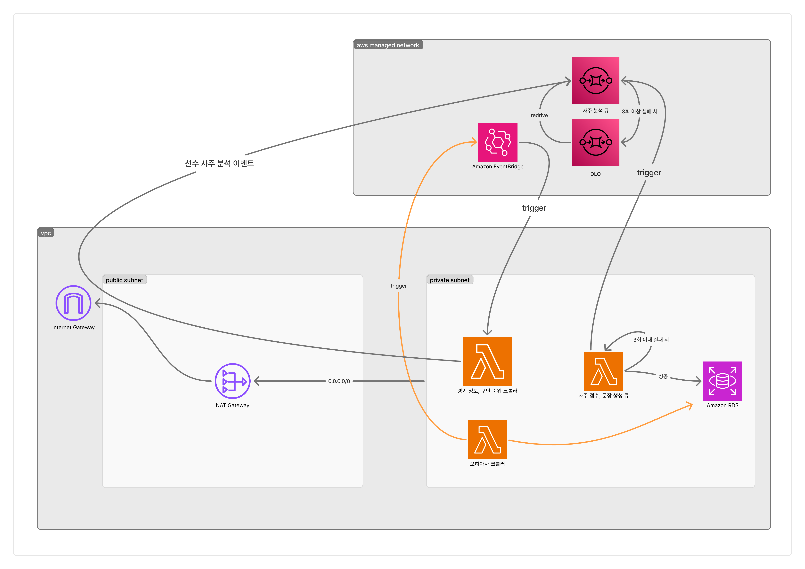

# Backend Batch

AWS Lambda에서 처리할 경기 정보 수집, 오늘의 사주 생성, 선수별 리포트 생성을 담당하는 배치 프로젝트입니다.

현재는 공통 모듈과 Lambda별 패키지를 분리해서 관리합니다.

```text
.
├── .dockerignore
├── .env.example
├── README.md
├── common
│   ├── pyproject.toml
│   └── src
│       └── common
│           ├── __init__.py
│           ├── db.py       <- DB 연결
│           ├── saju.py     <- 선수, 경기일 만세력 조회
│           └── schema.py   <- 공통 Pydantic 스키마
├── game-aggregator
│   ├── Dockerfile
│   ├── pyproject.toml
│   └── src
│       └── game_aggregator
│           ├── __init__.py
│           ├── aggregator.py
│           ├── crawler.py
│           ├── handlers
│           │   ├── __init__.py
│           │   └── aggregator_handler.py <- 경기 정보 수집 Lambda 진입점
│           ├── queries.py
│           └── sqs.py      <- Worker용 SQS 메시지 발행
├── ohaasa-aggregator
│   ├── pyproject.toml
│   ├── scripts
│   │   └── build_lambda_zip.sh
│   ├── src
│   │   └── ohaasa_aggregator
│   │       ├── __init__.py
│   │       ├── aggregator.py
│   │       ├── crawler.py
│   │       ├── handlers
│   │       │   ├── __init__.py
│   │       │   └── aggregator_handler.py <- 오늘의 사주 생성 Lambda 진입점
│   │       ├── llm.py
│   │       └── queries.py
│   └── uv.lock
└── worker
    ├── pyproject.toml
    ├── scripts
    │   └── build_lambda_zip.sh
    ├── src
    │   └── worker
    │       ├── __init__.py
    │       ├── handlers
    │       │   ├── __init__.py
    │       │   └── worker_handler.py <- SQS 배치 처리 Lambda 진입점
    │       ├── llm.py
    │       ├── prompts.py
    │       ├── queries.py
    │       └── worker.py   <- 선수별 사주 리포트 생성
    └── uv.lock
```

빌드 결과물과 로컬 실행 환경인 `.venv`, `.lambda_build`, `dist`, `__pycache__`는 구조도에서 제외했습니다.


